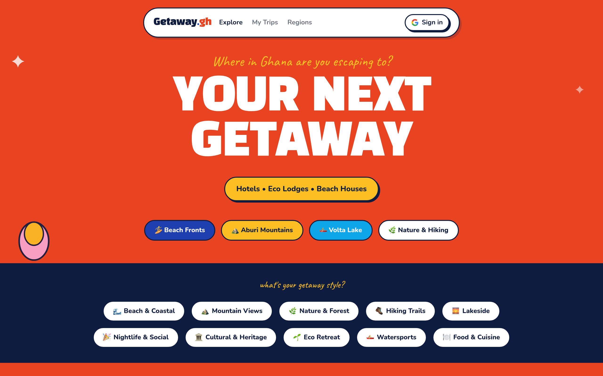
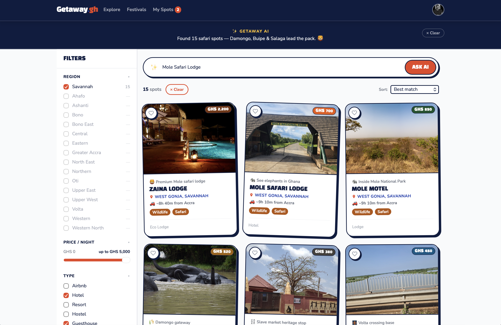

# Getaway.gh — Discover Weekend Escapes Across Ghana

AI-powered travel discovery for Ghana. Search by vibe, region, activity, or budget — and find beach fronts, mountain lodges, waterfall retreats, and hidden gems across all 16 regions.

**[→ Live at getaway-gh.vercel.app](https://getaway-gh.vercel.app)**



---

## Features

- **✨ AI Search** — type anything ("quiet beach under GHS 1000", "waterfall hiking with friends") and get ranked, summarised results
- **Autocomplete** — suggestions for cities, regions, and property names as you type
- **Smart filters** — region, type, activities, price range, and driving-from city
- **All 16 Ghana regions** — always visible in the sidebar; pre-checked based on results
- **Load more** — browse 14 spots at a time with a load-more card
- **Drive-time estimates** — shows driving distance and time from your chosen city
- **Activity filter** — scrollable 3-row chip selector on mobile, wrapping grid on desktop
- **Property detail pages** — gallery, itinerary, amenities, weather, nearby excursions, booking panel
- **My Spots** — save properties to your profile, synced via Firebase (Google sign-in)
- **Festivals calendar** — Ghana events by month
- Fully responsive — mobile, tablet, and desktop

## Screenshots

### Homepage — AI Search Hero


### Explore — All Destinations


---

## Tech Stack

| Tool | Purpose |
|------|---------|
| [Vite 6](https://vitejs.dev) | Build tool |
| [React 18](https://react.dev) | UI framework |
| [React Router 6](https://reactrouter.com) | Client-side routing |
| [Tailwind CSS 3](https://tailwindcss.com) | Styling |
| [Firebase](https://firebase.google.com) | Auth + Firestore (saved spots) |
| [Vercel](https://vercel.com) | Deployment |

---

## Getting Started

```bash
# Clone the repo
git clone https://github.com/kamensgh/getaway-gh.git
cd getaway-gh

# Install dependencies (requires Node 20+)
npm install

# Start dev server
npm run dev

# Build for production
npm run build
```

> **Note:** Requires Node 20. If you use nvm: `nvm use 20`

### Firebase (optional — for saved spots & Google sign-in)

Create a `.env.local` file in the project root:

```
VITE_FIREBASE_API_KEY=xxx
VITE_FIREBASE_AUTH_DOMAIN=xxx.firebaseapp.com
VITE_FIREBASE_PROJECT_ID=xxx
VITE_FIREBASE_STORAGE_BUCKET=xxx.appspot.com
VITE_FIREBASE_MESSAGING_SENDER_ID=xxx
VITE_FIREBASE_APP_ID=xxx
```

Enable **Google Sign-In** under Firebase Console → Authentication → Sign-in methods. The app works without these (saved spots fall back to localStorage).

---

## Project Structure

```
src/
├── components/
│   ├── ActivityFilter.jsx   # 3-row scrollable chip filter (mobile) / wrapping grid (desktop)
│   ├── Navbar.jsx           # Floating pill navbar; solid navy on search page
│   ├── PropertyCard.jsx     # Listing card with drive time + quick-save
│   └── TripBoard.jsx        # Saved spots grid
├── context/
│   ├── AuthContext.jsx      # Google auth state via Firebase
│   └── TripBoardContext.jsx # Saved spots — Firestore when signed in, localStorage fallback
├── data/
│   └── properties.js        # 20 Ghana listings with regions, activities, coords & safety info
├── pages/
│   ├── VibeHome.jsx         # Homepage — AI search bar, activity filter, curated sections
│   ├── SearchResults.jsx    # Results page — AI summary, sidebar filters, load more
│   ├── PropertyDetail.jsx   # Full listing — gallery, itinerary, amenities, booking panel
│   ├── ExploreGhana.jsx     # Regions explorer
│   ├── UserProfile.jsx      # My Spots — saved properties + sign out
│   └── Festivals.jsx        # Ghana events calendar
└── utils/
    ├── searchEngine.js      # Client-side AI search — keyword signals + property scoring
    └── driveTime.js         # Drive time estimates from Ghanaian departure cities
```

---

## Destinations

| Region | Highlights |
|--------|-----------|
| Greater Accra | Labadi Beach, Kokrobite, Coco Beach |
| Volta Region | Wli Waterfalls, Boti Falls, Volta Lake |
| Western Region | Busua Beach, Cape Three Points, Ankobra |
| Eastern Region | Aburi Botanical Gardens, Boti Falls |
| Central Region | Cape Coast, Elmina, Kakum Forest |
| Ashanti Region | Lake Bosomtwe, Kumasi |
| Northern Region | Mole National Park, Larabanga Mosque |
| Upper East | Bolgatanga, Paga Crocodile Pond |

---

## Design System

| Token | Value |
|-------|-------|
| Red | `#E84422` |
| Navy | `#0E1C40` |
| Yellow | `#F5C842` |
| Blue | `#1B6CA8` |
| Display font | Black Han Sans |
| Body font | Nunito |

Bold, energetic, and playful — built to match Ghana's travel spirit.

---

## License

MIT — free to use, fork, and build upon.

---

Built with ♥ for Ghana's travel community.
